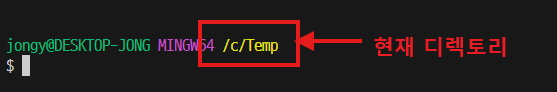
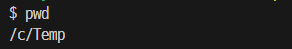

# CLI 명령어



- 항상 현재 작업 디렉토리를 확인하는 습관을 가지세요.

### `pwd`

- 현재 작업 디렉토리의 경로를 출력



### `touch` <파일명>

- 빈 텍스트 파일을 생성한다.
- 현재 작업 디렉토리가 아닌 곳에 파일을 생성하려면 **상대경로** 또는 **절대경로**로 작성
```sh
$ touch README.md

# 다수 파일들을 한번에 생성
$ touch a.txt b.txt c.txt

# 부모 디렉토리에 생성
$ touch ../parent.txt

# 자식 디렉토리에 생성
$ touch ./sub_folder/child.txt
```

### `mkdir` <폴더명>

- 폴더(디렉토리)를 생성
```sh
$ mkdir folder-name

# 경로를 지정해서 생성
$ mkdir ./folder-name/sub-folder
```

### `ls`

- 현재 폴더에 존재하는 파일/폴더들의 목록을 출력
```sh
$ ls
$ ls ..        # 부모 폴더 출력
$ ls /c/temp   # 절대 경로(루트부터)로 표현

# 숨김 파일/폴더도 모두 출력
$ ls -a        
```

### `rm`

- 파일/디렉토리 삭제
- 특히, 디렉토리를 삭제 할 때는 `-r` 옵션을 적용

```sh
$ rm <file-name>

# 디렉토리를 삭제하기
$ rm -r <folder-name>
```

### `cd` 

- 현재 작업 디렉토리를 변경
```sh
$ cd my_works

# 상대 경로 - 현재 디렉토리를 기준으로 표현
$ cd ./samples/test

# 절대 경로 - 루트 디렉토리를 기준으로 표현
$ cd /c/temp/samples
```

--------

### 경로 작성 시 `~` 의 의미
- 경로 표현에서 `~` 은 **홈 디렉토리를** 의미한다.
- 어디에 있든 `cd ~` 를 입력하면 본인의 홈 디렉토리로 이동한다.
	- 윈도우 환경에서 홈은 `c:\Users\<계정명>` 이다.
	- 터미널에서는`pwd`로 확인하면 `/c/Users/<계정명>` 로 출력


#### !!주의!!

> CLI 환경(터미널)에서 명령어를 실행할 때는  항상 현재 작업 디렉토리(present working directory)를 인지하고 있어야 한다.
> 
> - `pwd` 명령어를 입력하면 현재 작업 디렉토리의 정보를 출력한다.

> **간단 실습**
> 1. 현재 디렉토리에 `sample.txt` 파일을 생성한다.
> 2. '안녕하세요!!' 라고 입력하고 저장한다.
> 3. 터미널에서 `cat sample.txt` 라고 입력해서 결과를 확인한다.
	- `cat` 은 텍스트 파일의 내용을 출력하는 명령어
> 4. 부모 디렉토리로 이동한다.
> 5. `cat sample.txt` 이라고 입력했을 때 에러 메시지를 확인한다.

-----

## 유용한 기능

### `Tap` 키를 잘 활용한다.
- 명령어 다음에 오는 파일이름이나 경로를 작성하는 경우 일부만 작성한 상태에서 `Tab`키를 누르면 자동 완성된다

### 터미널에 출력된 내용 지우기
- `clear` 또는 `CRTL + L` 을 입력

### 명령어에 대한 도움말
- `--help` 옵션을 사용
- 예> `ls --help`

