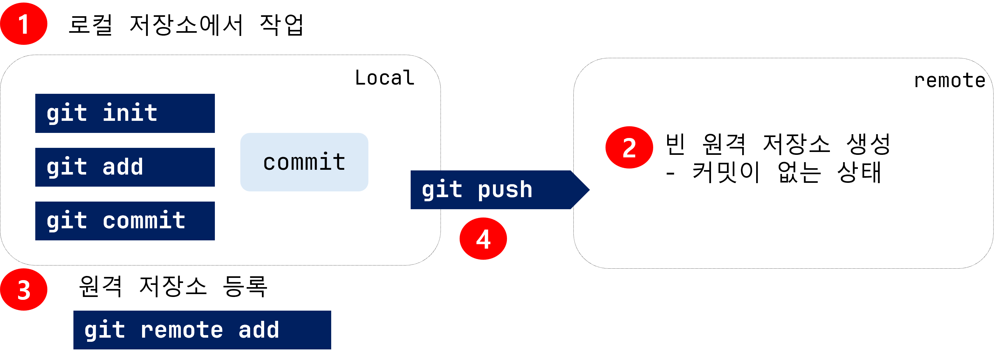

# Git 기초

- Git 명령어 형태

```
$ git <커맨드> <옵션> <인자> 
```
- git 명령은 `git`으로 시작
- 옵션은 `-` 또는 `--` 로 시작
- 명령에 필요한 추가적인 정보는 인자로 전달
- 커맨드마다 사용할 수 있는 옵션과 인자가 다르다

## 주요 git 명령어 


- `git init`
- `git add`
- `git status`
- `git commit`
- `git log`
- `git push`
- `git pull`

## 사용자 정보 설정

- 커밋을 할 때 사용자의 이름과 이메일 정보도 기록해야 한다
- **사용자 정보가 없으면, 커밋이 정상적으로 처리되지 않는다.**

```bash
$ git config --global user.name "<사용자이름>"
$ git config --global user.email "<이메일주소>"
```
- `--global` 옵션을 사용하면 모든 저장소에 적용된다.
  - `~/.gitconfig` 파일에 저장됩니다.


```bash
$ git config --global --list
```
- `.gitconfig`의 내용을 출력


## 로컬 저장소

- **작업 공간(working directory / working tree)**: 사용자의 일반적인 작업을 하는 공간
- **스테이지(staging area)**: 커밋을 할 파일/폴더들이 등록되는 곳
- **저장소(commits)**: staging area의 파일들의 변경사항들이 저장되는 곳

## Git 초기화 

- 로컬 저상소 생성

```bash
$ git init
```
- 현재 디렉토리를 Git으로 관리하겠다는 명령어
- `.git` 이라는 숨긴폴더가 생성되고, 터미널에 `(master)`가 표시된다

> **### 주의 사항 ###** 
> 
> - 이미 git에 의해 관리되는 폴더 내부에서 다시 init을 실행하지 않는다.
> - 홈 디렉토리(`~`) 에서 실행하지 않는다.

## git status

- **working directory** 와 **staging area** 에 있는 파일의 현재 상태를 알려주는 명령어

- 어떤 작업을 하기전에 수시로 **status** 를 확인하는 습관을 가지자.

- 파일의 상태
  
  - `untracked`: Git이 관리하지 않는 파일들(한번도 staging area에 등록되지 않은 파일들)
  - `tracked`: Git이 관리하는 파일

## git add

- **working directory** 의 파일을 **staging area** 에 등록
- 등록된 파일을 Git 이 추적 관리한다.

```bash
$ git add a.txt             # a.txt 등록
$ git add my_folder         # my_folder 아래의 모든 파일들 등록
$ git add my_folder/a.txt   # my_folder 아래 a.txt 등록


# 모든 파일들을 등록
$ git add .                 # 현재 디렉토리에 포함된 모든 파일들 등록
```

## git commit

- **Staging area** 에 등록된 파일의 변경 사항을 하나의 버전(커밋)으로 저장하는 명령어
- `커밋 메시지`를 작성해야 된다.
  - 변경사항을 잘 표현할 수 있도록 의미있게 작성한다.
- 최초 커밋 시에는 (root-commit) 이 출력

```bash
$ git commit 
# 커밋 메시지 작성을 위해 vim 에디터가 실행된다.

# commit 명령과 함께 커밋 메시지를 작성한다.
$ git commit -m '커밋 메시지'
```

## git log

- 현재까지 작성된 커밋들의 정보를 표시

```bash
# commit 정보 출력하기
$ git log

# 한줄로 요약해서 표시
$ git log --oneline
```

-------------

## 원격 저장소 등록

```bash
$ git remote add origin https://github.com/ssafydaily/TIL.git
```

- `origin` : 원격 저장소의 이름


## 원격 저장소 정보 조회

```bash
$ git remote -v
```

## 원격 저장소 연결 삭제

```shell
$ git remote rm origin
```

## git push

- 로컬 저장소의 커밋들을 원격저장소에 업로드 한다.
- 로컬 저장소의 커밋과 원격저장소의 커밋순서를 동기화 시킨다.

```bash
$ git push origin master

# -u 옵션을 사용한 후에는 저장소 이름(origin), 브랜치 이름(master)를 생략 가능함
$ git push -u origin master
```

- `master`: 브랜치 이름

> !!!!주의!!!! 원격 저장소에서 직접 수정작업을 하지 않는다.
> - 원격저장소의 내용을 직접 수정하고 저장하면 새로운 commit이 생성된다.
> - 따라서, 원격과 로컬의 커밋 내역이 달라지므로, 협업 상황에서는 문제가 발생할 가능성이 높아진다.


## git pull

- 원격 저장소의 커밋을 가져와서 로컬 저장소에 동기화시킨다.

```shell
$ git pull origin master
```


## git 프로젝트 시작하기

### a. 로컬 저장소에 이미 작성된 commit을 원격 저장소에 push하기



- 원격 저장소는 커밋이 없는 빈 저장소여야 한다.


-----------

### b. 원격 저장소에 이미 작성된 커밋을 로컬에 복제하기


- `git clone`을 통해 원격 저장소를 로컬에 복제한다.
- `git init`, `git remote add` 실행할 필요 없음
- 작업을 하고 `add`, `commit`, `push` 진행하면 된다
