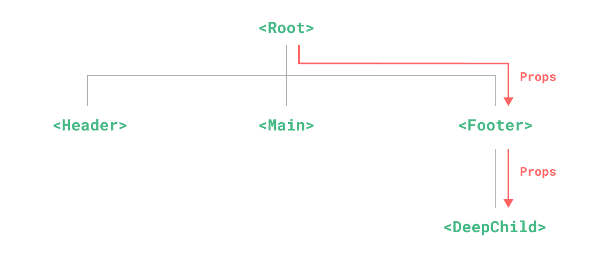
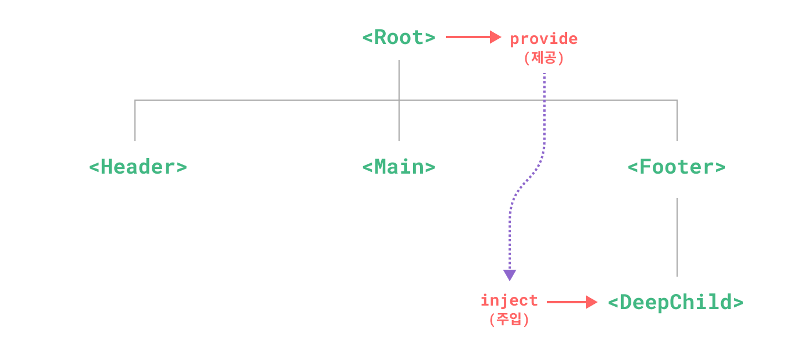

# Provide / inject

## Prop drilling [<Badge type="tip" text="원문" vertical="middle"/>](https://vuejs.org/guide/components/provide-inject.html#prop-drilling)

*[이미지 출처](https://vuejs.org/guide/components/provide-inject.html)*

- **`<root>`** 컴포넌트가 **`<footer>`** 컴포넌트에게 **prop** 을 전달, **`<footer>`** 는 **`<DeepChild>`** 에게 전달
- **`<footer>`** 는 **prop** 이 필요하지 않더라고, 자식 컴포넌트에 전달하기 이를 선언하고 전달애 한다.
- 이런 현상을 **prop drilling** 이라 한다.

---------

*[이미지 출처](https://vuejs.org/guide/components/provide-inject.html)*

- **provide** 와 **inject** 로 **prop drilling** 을 해결
- 부모 컴포넌트는 모든 자식 컴포넌트에 대한 **의존성 제공자 역할** 이 가능
- 하위 트리의 모든 컴포넌트는 깊이에 관계 없이 상위 컴포넌트에서 제공(provide)하는 의존성을 주입(inject)할 수 있음

## Provide

- 부모 컴포넌트에서 `provide()`[<Badge type="tip" text="doc" vertical="middle"/>](https://ko.vuejs.org/api/composition-api-dependency-injection.html#provide) 함수를 사용

- 첫 번째 인자는 주입 키라고 하며 문자열 또는 `Symbol` 
- 주입 키는 자식 컴포넌트에서 주입할 원하는 값을 조회하는 데 사용
- `provide()` 는 여러번 호출 가능

```js
<script setup>
import { provide } from 'vue'

provide(/* 키 */ 'message', /* 값 */ '안녕!')
</script>
```

- 반응형 값을 제공하면, 제공된 값을 사용하는 자식 컴포넌트가 제공자 컴포넌트에 대한 반응형 연결을 설정

```js
import { ref, provide } from 'vue'

const count = ref(0)
provide('key', count)
```

### 앱 수준의 provide

- 엡 수준의 `provide` 는 모든 컴포넌트에서 사용 가능
- 플러그인은 일반적으로 컴포넌트를 사용하여 값을 제공할 수 없기 때문에 플러그인 작성에 유용

```js
import { createApp } from 'vue'

const app = createApp({})

app.provide(/* 키 */ 'message', /* 값 */ '안녕!')
```

## inject

```js
<script setup>
import { inject } from 'vue'

const message = inject('message')
</script>
```
- 제공된 값이 `ref`인 경우, 그대로 주입되고 자동으로 래핑 해제되지 않음


### 주입시 기본 값 설정

```js
// `value` 값은 "default value"가 됩니다.
// "message"에 해당하는 데이터가 제공되지 않은 경우
const value = inject('message', '이것은 기본 값 문자열 입니다.')
```


### 반흥형으로 만들기